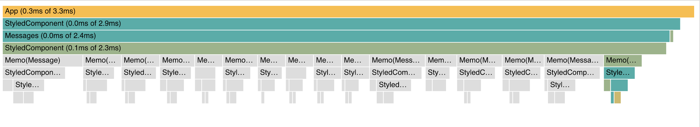

# Hookchat

Some demo code to showcase converting an app to using React hooks.

## Usage

First get this API up and running: [https://github.com/spiderbites/hookchat-api](https://github.com/spiderbites/hookchat-api)

Then...

```bash
yarn install
yarn start
```

In `./src/index.js`, swap the import statement to move between the `classic` version and the `hooks` version.

## React.memo

[Docs](https://reactjs.org/docs/react-api.html#reactmemo)

_tl;dr_ Wrap a functional component with `React.memo` to only re-render when props change. If the props don't change, "React will skip rendering the component, and reuse the last rendered result."

The images below were produced using the React Dev Tools profiler.

Note that in reality you'd want to use a windowing solution to render long lists of messages, this is simply for demonstration.

#### Flame chart

The grey bars indicate message components were not re-rendered. Also note the total time for the `commit` phases.




#### Ranked chart

Each bar in the chart represents a component, ordered by how long they took to render.


#### Flame chart for 200 messages


